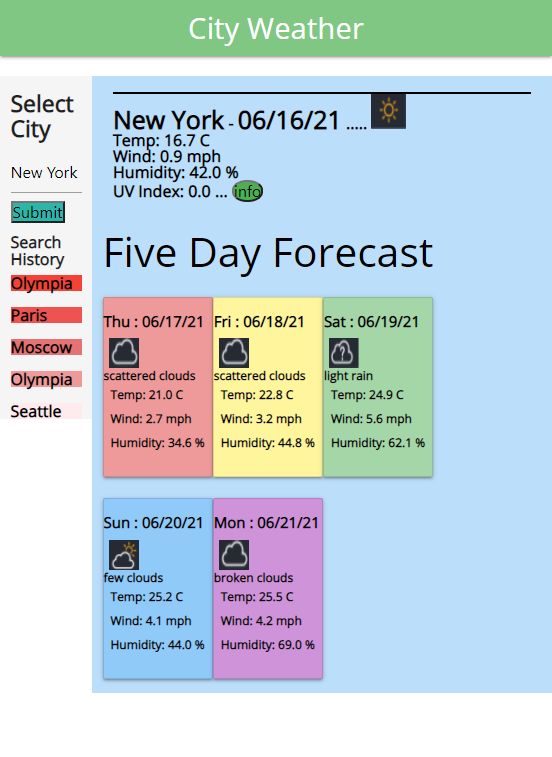

# WeatherReport
City Weather Report

# Working Files
HTML,CSS Files: https://github.com/gmcmurray/WeatherReport

Deployed Application: https://gmcmurray.github.io/WeatherReport/

## Description 

City Weather report which provides current and 5-day forecast weather
by making calls from Open Weather API.  User inputs city and 
API provides temperature, wind, humidity and UVI index.
Weather Icons are provided to dgive a visual queue for
weather conditions.  UVI index is provided and health alerts
(low, moderate and high) are provided through a color coded
button.

## Skills and Coding Features
Third party API - Open Weather was used to retrieve given city weather data.
Three separate fetch() calls were required to achieve API requirements.
1) weather => todays weather conditions retrieved using city
2) onecall => UVI index, required lat and lon of city to  retrieve data
3) forecast => 5 day forecast 

Fetch command along with JSON.parse() was used to retireve targeted data.
Materialize CSS was used as framework to style page.  Used a list to
track Search History- 5 items, this was updated for each submital and saved
in localStorage.

## Screen Shots
Screen shots with width of 550 pixels below.

Page 1 - Main Page
